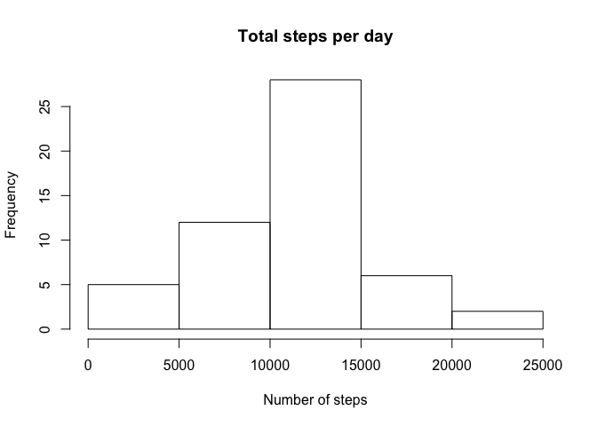
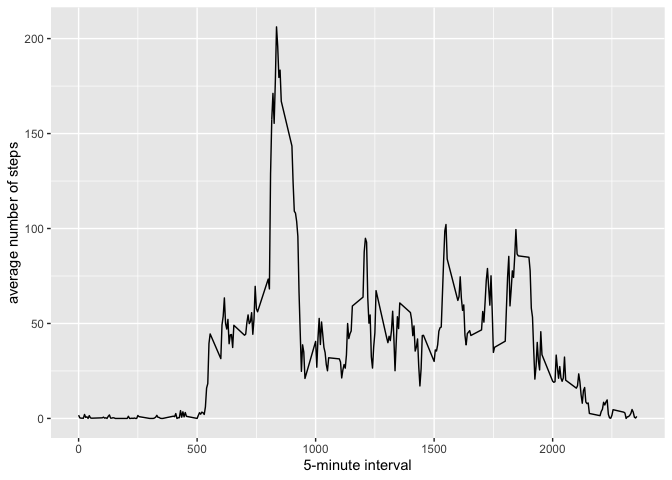
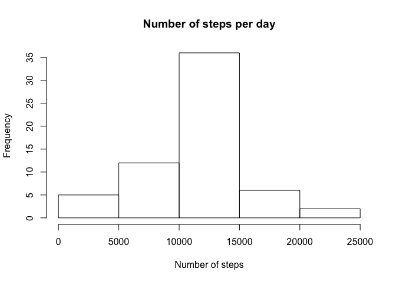
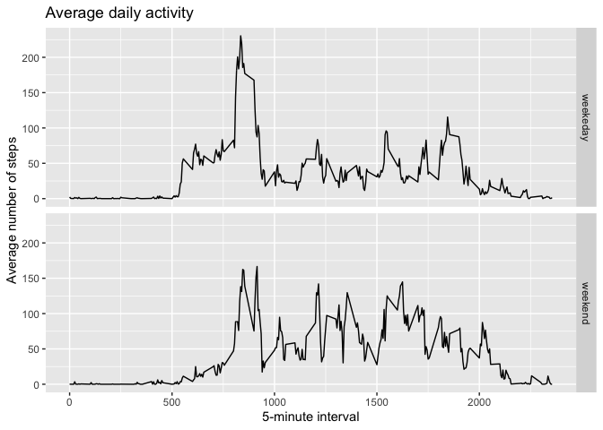

## Loading and preprocessing the data

```r
if (!file.exists('activity.csv')) {
  unzip(zipfile = "activity.zip")
}
data <- read.csv("activity.csv")
```

## What is mean total number of steps taken per day?

```r
steps <- aggregate(steps ~ date, data, FUN=sum)

hist(steps$steps,
     main = "Total steps per day",
     xlab = "Number of steps")
```

<!-- -->

```r
mean(steps$steps, na.rm = TRUE)
```

```
## [1] 10766.19
```

```r
median(steps$steps, na.rm = TRUE)
```

```
## [1] 10765
```

## What is the average daily activity pattern?

```r
library(ggplot2)
averages <- aggregate(steps ~ interval, data, mean)
ggplot(data=averages, aes(x=interval, y=steps)) +
    geom_line() +
    xlab("5-minute interval") +
    ylab("average number of steps")
```

<!-- -->

5-minutes interval that contains the maximum number of steps:

```r
averages[which.max(averages$steps),]
```

```
##     interval    steps
## 104      835 206.1698
```

## Imputing missing values
There are a number of days/intervals where there are missing values (coded as \color{red}{\verb|NA|}NA). The presence of missing days may introduce bias into some calculations or summaries of the data.

```r
missing <- is.na(data$steps)
table(missing)
```

```
## missing
## FALSE  TRUE 
## 15264  2304
```

Each missing value will be replaced with the mean value of its 5-minute interval


```r
with_missing_values <- transform(data, steps = ifelse(is.na(data$steps), averages$steps[match(data$interval, averages$interval)], data$steps))
averages_with_missing <- aggregate(steps ~ date, with_missing_values, FUN=sum)
hist(averages_with_missing$steps,
     main = "Number of steps per day",
     xlab = "Number of steps")
```

<!-- -->

To understand the difference:


```r
mean(averages_with_missing$steps, na.rm = TRUE)
```

```
## [1] 10766.19
```

```r
median(averages_with_missing$steps, na.rm = TRUE)
```

```
## [1] 10766.19
```

Becauuse of missing values where replaced with the average, the median changed the value to be equals to the mean

## Are there differences in activity patterns between weekdays and weekends?


```r
weekOrWeekend <- function(date) {
    day <- weekdays(date)
    if (day %in% c('Monday', 'Tuesday', 'Wednesday', 'Thursday', 'Friday'))
        return ("weekeday")
    else if (day %in% c('Saturday', 'Sunday'))
        return ("weekend")
    else
        stop ("Invalid Date Format.")
}
with_missing_values$date <- as.Date(with_missing_values$date)
with_missing_values$day <- sapply(with_missing_values$date, FUN = weekOrWeekend)

meanSteps <- aggregate(steps ~ interval + day, with_missing_values, mean)
ggplot(data = meanSteps, aes(x = interval, y = steps)) + 
    geom_line() +
    facet_grid(day ~ .) +
    ggtitle("Average daily activity") +
    xlab("5-minute interval") +
    ylab("Average number of steps")
```

<!-- -->


